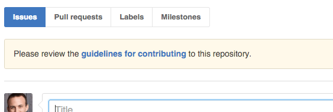

# Contributing

You **always** want to look at this file *before* contributing. In here you should find
steps that you need to take to set up your development environment as well as instructions
for coding standards and contributing guidelines.

You'll notice that when this file is present, GitHub will give you an alert when creating
a new issue, indicating that you should check out the guidelines first:

## Set up instructions

1. Fork the repo
2. Clone your fork
3. Create a branch
4. Run `npm install`
5. Run `npm t && npm run build`. If everything works, then you're ready to make changes.
6. Run `npm run test:watch`. See that it's watching your file system for changes.
7. Make your changes and try to make the tests pass. If you can't or need help then commit what you have with `--no-verify` and make a PR
8. If you get things working, add your changed files with `git add` and run `npm run commit` to get an interactive prompt for creating a commit message that follows [our standards](https://github.com/ajoslin/conventional-changelog/blob/master/conventions/angular.md)
9. Push your changes to your fork with `git push`
10. Create a pull request.
11. Iterate on the solution.
12. Get merged! 🎉 🎊

## Commit messages

We follow a convention for our commit messages, to learn about why and how, see [this free egghead.io series](http://kcd.im/write-oss)

